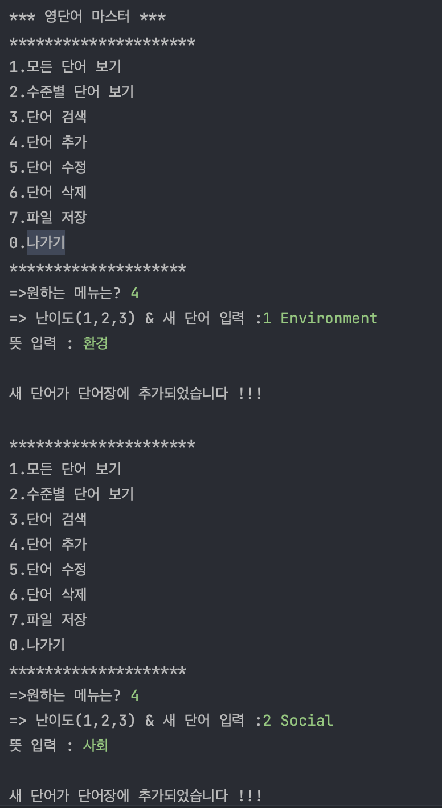
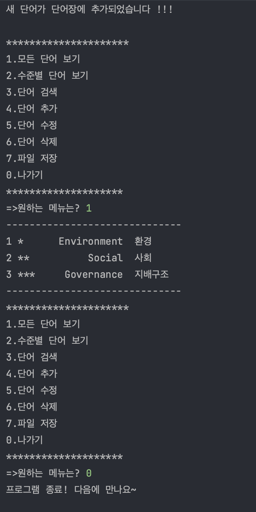
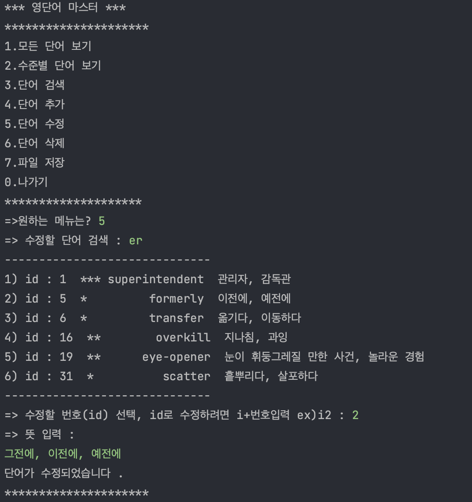
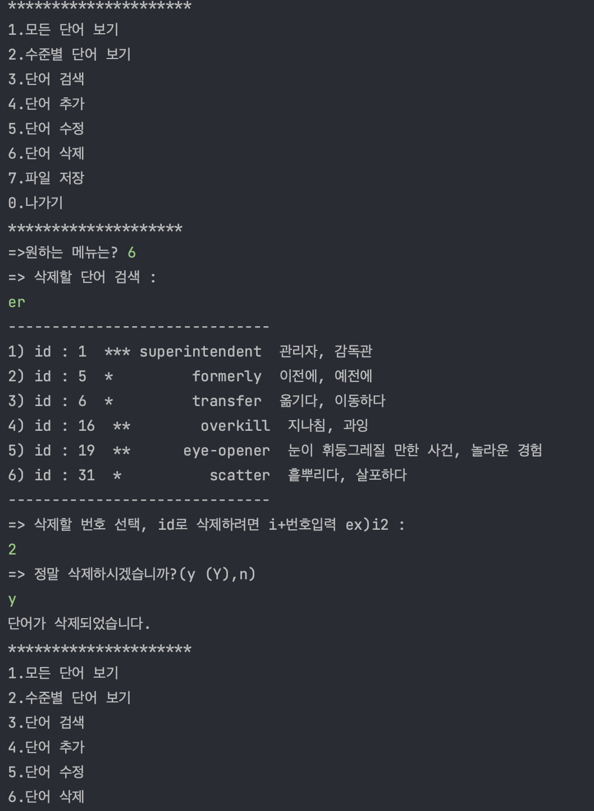
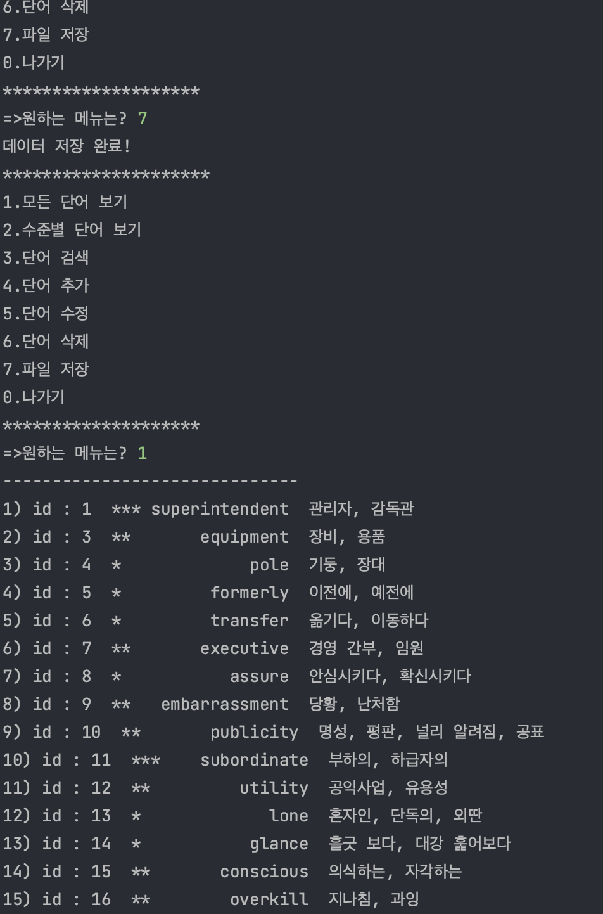
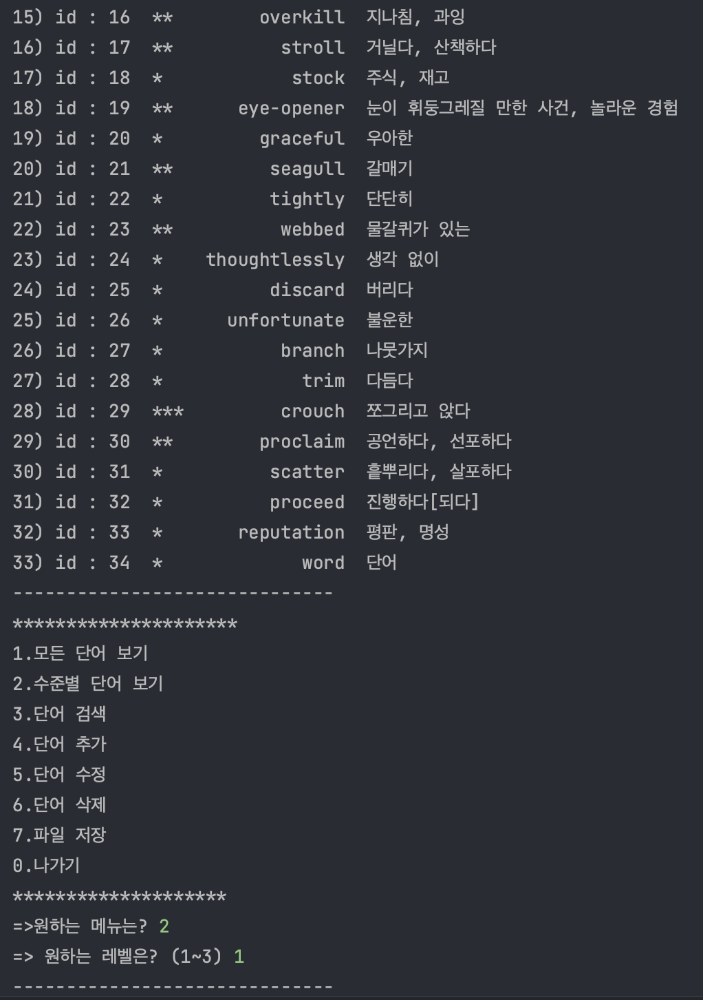
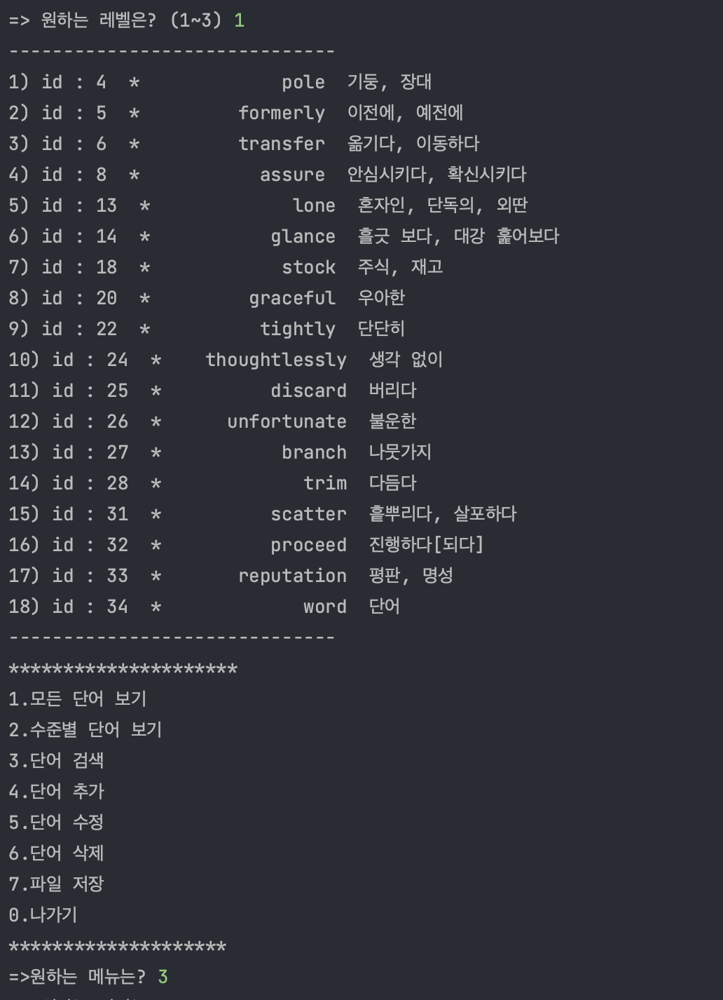
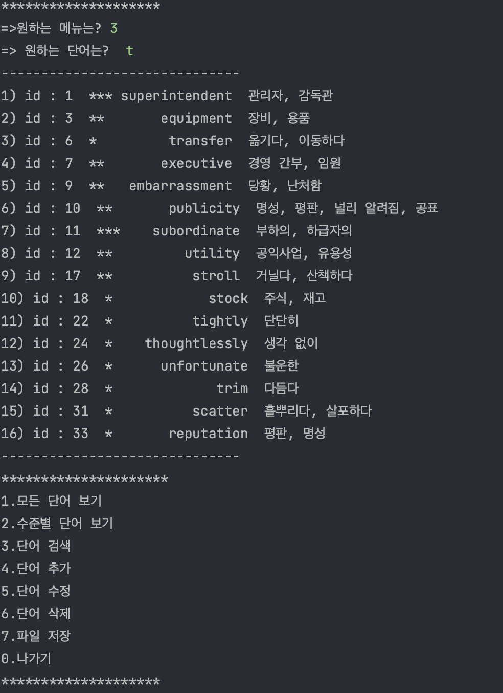
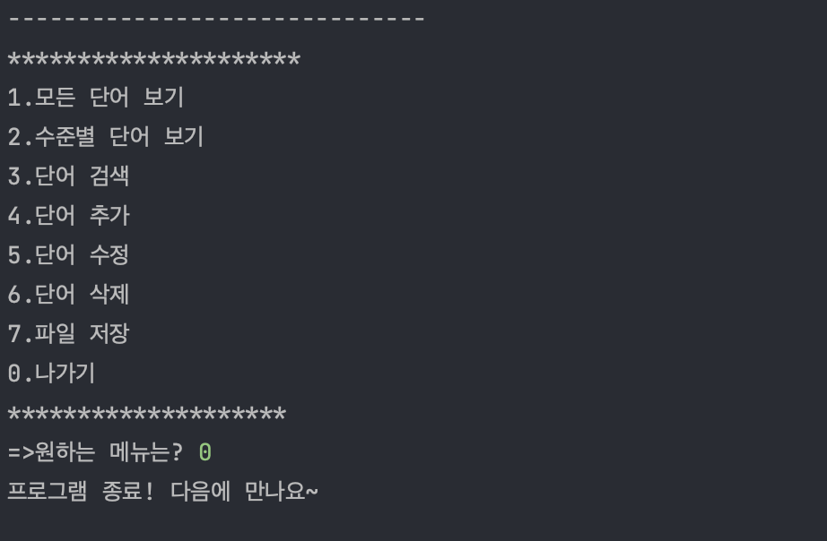

## Project1. Java CRUD project with file I/O
### step 1

---

push and read

#### - goal
- Make dictionary
- Implement Create & Read(List)

#### - result

### step 2

---

push and read

#### - goal
- Make dictionary
- Implement Create & Read & Update and Delete
- Connect db(sqlite)

#### - result

---

### - DB browser for Sqlite